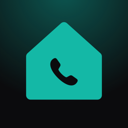
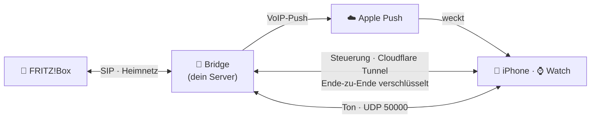

<div align="center">



# Housephone

**Dein Festnetz auf iPhone und Apple Watch – über deine FRITZ!Box.**<br/>
Zu Hause und unterwegs, ohne VPN, mit echtem Anruf-Bildschirm.

[](https://github.com/JoKeks2023/housephone/actions/workflows/bridge.yml)
[](https://github.com/JoKeks2023/housephone/actions/workflows/ios.yml)
[](https://github.com/JoKeks2023/housephone/pkgs/container/housephone-bridge)
<br/>


[Einrichtung](#-einrichtung-in-9-schritten) · [Alltag](#-alltag) · [Hilfe](#-wenn-etwas-nicht-klappt) · [Sicherheit](#-wie-sicher-ist-das) · [Entwicklung](#-entwicklung)

</div>

---

## ✨ Was Housephone kann

<table>
<tr>
<td width="33%" valign="top">

### 📞 Wie ein echtes Telefon
Anrufe klingeln über **CallKit** wie normale Anrufe, auch bei gesperrtem iPhone. Rückruf direkt aus der iPhone-Anrufliste.

</td>
<td width="33%" valign="top">

### ⌚ Watch klingelt selbst
Annehmen und Sprechen **am Handgelenk**, auch ohne iPhone in der Nähe. Die Watch koppelt sich automatisch.

</td>
<td width="33%" valign="top">

### 🌍 Überall, ohne VPN
Zu Hause und unterwegs, im WLAN und im Mobilfunk. Ein laufendes Gespräch übersteht auch einen Netzwechsel.

</td>
</tr>
<tr>
<td valign="top">

### 📒 FRITZ!Box-Telefonbuch
Kontakte und Anrufliste deines **ganzen Anschlusses**, auch was am Schnurlostelefon lief. Namen erscheinen auch bei eingehenden Anrufen.

</td>
<td valign="top">

### 🔐 Ende-zu-Ende gesichert
Schlüssel im **Secure Enclave**, gepinnte Bridge, verschlüsselte Steuerung, auch gegenüber Cloudflare.

</td>
<td valign="top">

### 🐳 Ein Container
Die Bridge läuft als gehärteter **Docker-Container** mit Admin-Oberfläche im Terminal (`./housephone tui`).

</td>
</tr>
</table>

## 🧭 So funktioniert's



Die **Bridge** meldet sich an deiner FRITZ!Box als ganz normales IP-Telefon an. Klingelt dein Festnetz, weckt sie iPhone und Watch per Push, und wer zuerst annimmt, bekommt das Gespräch. Es wird **kein TCP-Port** geöffnet, nur ein UDP-Port für den Ton.

---

## 🚀 Einrichtung in 9 Schritten

| # | Schritt | Wo | ⏱ |
|:-:|---|---|:-:|
| 1 | [FRITZ!Box vorbereiten](#1--fritzbox-vorbereiten) | FRITZ!Box | 10 min |
| 2 | [Push-Schlüssel](#2--push-schlüssel-bei-apple) | developer.apple.com | 5 min |
| 3 | [Cloudflare Tunnel](#3--cloudflare-tunnel) | Cloudflare | 10 min |
| 4 | [Bridge starten](#4--bridge-auf-dem-server-starten) | Server | 10 min |
| 5 | [Selbsttest](#5--selbsttest) | Server | 2 min |
| 6 | [App installieren](#6--app-aufs-iphone-und-die-watch) | Mac + iPhone | 15 min |
| 7 | [Koppeln](#7--iphone-koppeln) | Server + iPhone | 2 min |
| 8 | [Telefonbuch](#8--optional-telefonbuch--anrufliste) *(optional)* | FRITZ!Box + Server | 5 min |
| 9 | [Ausprobieren](#9--ausprobieren) | Telefon | 5 min |

> [!NOTE]
> **Du brauchst:** eine FRITZ!Box mit Telefonie, einen Server im Heimnetz, der immer läuft (Linux mit Docker, z. B. Mini-PC, NAS, Raspberry Pi 4/5), einen **bezahlten Apple-Developer-Account**, einen **kostenlosen Cloudflare-Account mit eigener Domain** und einen Mac mit Xcode.

### 1 · FRITZ!Box vorbereiten

Öffne die Oberfläche deiner Box, z. B. `http://fritz.box` oder bei Vodafone-Kabel `http://192.168.0.1`.

**a) Feste IP für den Server:** **Heimnetz → Netzwerk → Netzwerkverbindungen** → beim Server ✏️ → **„Diesem Netzwerkgerät immer die gleiche IPv4-Adresse zuweisen“**.

**b) IP-Telefon anlegen**
1. **Telefonie → Telefoniegeräte → Neues Gerät einrichten**
2. **Telefon (mit und ohne Anrufbeantworter)** → **LAN/WLAN (IP-Telefon)** → Name `Housephone`
3. Benutzername (z. B. `housephone`) und ein **langes Kennwort** notieren
4. Festlegen, mit welcher Nummer es **rausruft** und auf welche es **reagiert**

**c) Portfreigabe für den Ton:** **Internet → Freigaben → Portfreigaben → Gerät für Freigaben hinzufügen** → Server → **Neue Freigabe** → *Andere Anwendung*

| Protokoll | Port an Gerät | bis Port | extern |
|:-:|:-:|:-:|:-:|
| **UDP** | 50000 | 50000 | 50000 |

> [!TIP]
> Mehr muss nicht offen sein. **„Anmeldung aus dem Internet erlauben“** beim IP-Telefon bleibt **aus**, weil die Bridge im Heimnetz steht.

### 2 · Push-Schlüssel bei Apple

Damit das iPhone klingelt, auch wenn die App geschlossen ist:

1. [developer.apple.com → **Keys**](https://developer.apple.com/account/resources/authkeys/list) → **＋** → Name `Housephone Push` → ☑️ **Apple Push Notifications service (APNs)** → Register
2. **`AuthKey_XXXXXXXXXX.p8` herunterladen** und die **Key ID** notieren

> [!IMPORTANT]
> Die `.p8`-Datei lässt sich **nur einmal** herunterladen. Bewahr sie gut auf.

### 3 · Cloudflare Tunnel

Damit iPhone und Watch die Bridge von unterwegs erreichen, ohne VPN und ohne offenen TCP-Port:

1. [one.dash.cloudflare.com](https://one.dash.cloudflare.com) → **Networks → Tunnels → Create a tunnel** → **Cloudflared** → Name `housephone`
2. Bei „Install connector“ **nichts installieren**, nur den **Token** kopieren
3. **Public Hostname:** Subdomain `phone` · Domain `deine-domain.de` · Service **HTTP** → `localhost:8080`

Deine Bridge-Adresse ist dann **`wss://phone.deine-domain.de/v1/ws`**.

### 4 · Bridge auf dem Server starten

Voraussetzung ist [Docker mit Compose](https://docs.docker.com/engine/install/).

```sh
git clone https://github.com/JoKeks2023/housephone.git
cd housephone/bridge
cp config.example.yaml config.yaml
cp docker-compose.example.yml docker-compose.yml
mkdir -p data secrets
```

**`config.yaml`** – diese vier Werte anpassen:

```yaml
bridge:
  name: "Zuhause"                                   # erscheint in der App
  publicUrl: "wss://phone.deine-domain.de/v1/ws"    # aus Schritt 3
sip:
  registrar: "192.168.0.1"                          # IP deiner FRITZ!Box
  username: "housephone"                            # aus Schritt 1b
```

**Geheimnisse** – bleiben auf dem Server, nie im Repo:

```sh
printf '%s' 'KENNWORT-DES-IP-TELEFONS' > secrets/sip_password
cp ~/Downloads/AuthKey_XXXXXXXXXX.p8 secrets/apns_key.p8
echo 'CLOUDFLARE_TUNNEL_TOKEN=DEIN-TOKEN' > .env
chmod 600 secrets/* .env
```

In **`docker-compose.yml`** die Key ID eintragen: `HOUSEPHONE_APNS_KEY_ID: "ABCDE12345"`

```sh
docker compose up -d
```

> [!WARNING]
> Bei `registrar` die **IP** der FRITZ!Box eintragen, nicht `fritz.box`. Dieser Name kann über öffentliches DNS zu einem fremden Server auflösen. Die Bridge startet deshalb absichtlich nicht, wenn die Adresse nicht im Heimnetz liegt.

<details>
<summary><b>Der Container findet seine Dateien nicht (Rechte)?</b></summary>

Der Container läuft als Benutzer `1000:1000`. Hat dein Benutzer eine andere ID, gilt eine der beiden Varianten:

```sh
sudo chown -R 1000:1000 data secrets
# oder in docker-compose.yml bei "user:" deine IDs eintragen (id -u / id -g)
```
</details>

<details>
<summary><b>🏠 Stattdessen als Home-Assistant-Add-on</b> (Home Assistant OS oder Supervised)</summary>

Die Bridge läuft auch als Add-on in deiner Home-Assistant-Instanz, mit Dashboard in der Seitenleiste (Status, Anrufe, Geräte, Koppeln per QR-Code, nur für HA-Admins).

1. **Einstellungen → Add-ons → Add-on Store → ⋮ → Repositories**: `https://github.com/JoKeks2023/housephone` hinzufügen
2. **Housephone Bridge** installieren, im Reiter **Konfiguration** FRITZ!Box, IP-Telefon, öffentliche URL und APNs eintragen, starten
3. Den Tunnel übernimmt das Community-Add-on **Cloudflared** mit `service: http://172.30.32.1:8080`
4. Portfreigabe UDP 50000 auf den Home-Assistant-Rechner wie oben

Schritt 4 (Compose), 5 (TUI) und 7 (Koppeln per Shell) entfallen: Status und Koppeln stehen im Dashboard. Alles Weitere steht in der [Add-on-Dokumentation](ha-addon/housephone-bridge/DOCS.md). Mit Home Assistant Container nimmst du Docker Compose wie oben.
</details>

<details>
<summary><b>Image selbst bauen statt aus der Registry ziehen</b></summary>

In `docker-compose.yml` `image:` auskommentieren und `build: .` aktivieren. Das fertige Image `ghcr.io/jokeks2023/housephone-bridge` gibt es für amd64 und arm64:
- `:edge` = jeder Stand von `master`
- `:latest` = die letzte Version
</details>

### 5 · Selbsttest

```sh
./housephone tui      # dann Taste 6
```

```
  ● FRITZ!Box-Anmeldung      angemeldet an 192.168.0.1
  ● Push (APNs)              eingerichtet
  ● Öffentliche IP           94.x.x.x (von der FRITZ!Box)
  ● Medienport               UDP 50000 lokal offen
  ● Öffentliche Adresse      wss://phone.deine-domain.de/v1/ws
```

Jede Zeile ist 🟢 grün, 🟡 gelb oder 🔴 rot. Mit ↑/↓ siehst du, was zu tun ist.
Weitere Tabs: **1** Übersicht · **2** Geräte · **3** Kopplung · **4** Anrufe · **5** Logs. **?** zeigt die Hilfe, **q** beendet.

### 6 · App aufs iPhone (und die Watch)

Auf dem Mac, einmalig: im Finder **`Housephone einrichten.command`** im Housephone-Ordner doppelklicken. Das Skript prüft Xcode, lässt dich dein **Apple-Team** und das **Bundle-ID-Präfix** aus einer Liste wählen, schreibt beides nach `ios/Config/Local.xcconfig` (nicht eingecheckt), zeigt das passende `apns.topic` für die Bridge und öffnet auf Wunsch das Projekt.

> [!NOTE]
> Hast du Housephone als ZIP von GitHub geladen, blockiert macOS das Skript beim ersten Mal. Dann: Rechtsklick → **Öffnen**, oder einmal `xattr -d com.apple.quarantine "Housephone einrichten.command"`. Mit `git clone` passiert das nicht.

1. In Xcode oben dein **iPhone** als Ziel, Scheme **Housephone** → ▶︎
2. **Beim ersten Mal:** auf dem iPhone **Einstellungen → Datenschutz & Sicherheit → Entwicklermodus** einschalten
3. **Watch:** in der **Watch-App** auf dem iPhone → **Verfügbare Apps → Housephone → Installieren**, falls sie nicht automatisch kommt

<details>
<summary><b>Xcode bemängelt „Push Notifications“?</b></summary>

Auf [developer.apple.com → Identifiers](https://developer.apple.com/account/resources/identifiers/list) bei `<präfix>.housephone` und `…watchkitapp` (Standard: `com.jorisconrad`) **Push Notifications** aktivieren und erneut bauen.
</details>

### 7 · iPhone koppeln

**Im Heim-WLAN ohne QR-Code:** Housephone öffnen. Die App findet die Bridge von selbst („Bridge „Zuhause“ gefunden“) → antippen → **Koppeln**. Das iPhone zeigt jetzt einen **sechsstelligen Code**. Gib ihn auf der Bridge frei, aber nur, wenn dort derselbe Code steht:

```sh
./housephone devices pending          # offene Anfragen mit Code
./housephone devices approve <ID>     # fragt: Zeigt das iPhone genau diesen Code?
```

Oder in der TUI (`./housephone tui`, Taste **3**, dann **a**) bzw. im Home-Assistant-Dashboard. Danach **Mikrofon erlauben** → fertig ✅

**Mit QR-Code** (erstes Gerät ohne Bonjour, Tailscale, Rückfall):

```sh
./housephone pair -name "iPhone Joris"
```

Im Terminal erscheint ein **QR-Code**. In der App → **QR-Code scannen** → **Mikrofon erlauben** → fertig ✅

- **Koppeln geht nur zu Hause:** Das iPhone muss im **Heim-WLAN** sein (oder per **Tailscale** verbunden, siehe unten). Gekoppelt wird über den privaten Zugang der Bridge (Port `8081`), nicht über den Tunnel. Unterwegs zeigt die App „Zum Koppeln ins Heim-WLAN oder Tailscale“.
- Für Port `8081` **keine Portfreigabe** in der FRITZ!Box einrichten. Er nimmt ohnehin nur Verbindungen aus dem Heimnetz an.
- Die App prüft dabei, dass sie **deine** Bridge erreicht: beim QR-Code über den Fingerabdruck darin, ohne QR-Code über den Code, den du vergleichst. Ein Angreifer im WLAN trifft denselben Code nur mit 1 zu 1 000 000.
- Gefunden wird die Bridge per Bonjour (`_housephone._tcp`). Abschalten mit `bonjour: false` unter `bridge:`.
- `pair` meldet, welches Gerät den Code benutzt hat. Warst du es nicht, reicht `./housephone devices remove <ID>`.
- **Die Watch koppelt sich automatisch**, sobald das iPhone im Heimnetz ist. Auf der Uhr musst du nie etwas scannen.
- Zu Hause telefoniert die App direkt über das WLAN mit der Bridge, unterwegs über den Tunnel. Sie wechselt von selbst.

<details>
<summary><b>Mit Tailscale</b> (Koppeln und Direktverbindung auch unterwegs)</summary>

Läuft auf dem Server Tailscale, in `config.yaml` unter `bridge:` eintragen:

```yaml
  tailscale: true
  lanUrl: "ws://100.x.y.z:8081/v1/ws"   # Tailscale-IP des Servers (tailscale ip -4)
```

Die IP statt des MagicDNS-Namens nehmen: iOS lässt unverschlüsselte Verbindungen nur zu IP-Adressen und lokalen Namen zu. Die Verbindung ist trotzdem Ende-zu-Ende gesichert.
</details>

### 8 · Optional: Telefonbuch & Anrufliste

1. **FRITZ!Box → System → FRITZ!Box-Benutzer → Benutzer hinzufügen:** Name `housephone`, nur das Recht **„Sprachnachrichten, Faxnachrichten, FRITZ!App Fon und Anrufliste“**
2. **Server:**
   ```sh
   printf '%s' 'KENNWORT' > secrets/fritzbox_password && chmod 600 secrets/fritzbox_password
   ```
   in `config.yaml`: `fritzbox:` → `username: "housephone"`, dann `docker compose up -d`

<details>
<summary><b>👨‍👩‍👧 Optional: Mehrere Personen mit eigener Nummer</b></summary>

Jede Person bekommt ein eigenes **Profil**: ein eigenes IP-Telefon an der FRITZ!Box, eigene Nummer, eigene Geräte. Anrufe auf ihre Nummer klingeln nur bei ihren Geräten, sie ruft mit ihrer Nummer an und sieht nur ihre Anrufe in der Anrufliste.

1. **FRITZ!Box → Telefonie → Telefoniegeräte → Neues Gerät → Telefon → LAN/WLAN (IP-Telefon):** zweites IP-Telefon anlegen, z. B. Benutzername `621`. Unter *Ausgehende Anrufe* und *Ankommende Anrufe* ihre Nummer wählen. Beim ersten IP-Telefon nur noch deine Nummer auswählen.
2. **Server:**
   ```sh
   printf '%s' 'KENNWORT-DES-ZWEITEN-IP-TELEFONS' > secrets/sip_password_b && chmod 600 secrets/sip_password_b
   ```
   in `config.yaml`:
   ```yaml
   profile:
     name: "Profil A"          # du (das IP-Telefon aus sip:)
     numbers: ["030 1234567"]
   lines:
     - id: profil-b
       name: "Profil B"
       sip:
         username: "621"
         passwordFile: /secrets/sip_password_b
       numbers: ["030 1234568"]
   ```
   dann `docker compose up -d`. `./housephone profiles` zeigt beide Profile; im Selbsttest der TUI muss jedes „angemeldet“ sein.
3. **Ihr iPhone koppeln:** wie in Schritt 7, nur beim Freigeben das Profil wählen (TUI fragt nach, CLI: `./housephone devices approve -profile profil-b <ID>`, QR-Code: `./housephone pair -profile profil-b`). Ihre Watch landet automatisch im selben Profil.

> [!NOTE]
> Bestehende Geräte bleiben im ersten Profil. Ein falsch zugeordnetes Gerät verschiebst du mit `./housephone devices move <ID> profil-b` (oder in der TUI mit `p`); es verbindet sich dabei neu. Im Home-Assistant-Add-on stehen dieselben Felder unter *Weitere Profile*, Zuordnen und Verschieben geht im Dashboard.

</details>

<details>
<summary><b>🛡 Optional: Verwaltung vom iPhone aus (Face ID)</b></summary>

Im Heim-WLAN (oder über Tailscale) verwaltest du die Bridge auch direkt in der App: **Einstellungen → Verwaltung**. Status, Geräte umbenennen, entfernen, in ein Profil verschieben, Kopplungsanfragen freigeben und neue Geräte per QR-Code einladen. Jede Änderung bestätigst du mit Face ID; unterwegs ist die Verwaltung ausgeblendet.

- **Neue Bridge:** Das erste gekoppelte iPhone ist automatisch Admin. Öffne direkt danach *Einstellungen → Verwaltung → Face ID für die Verwaltung einrichten* (innerhalb einer Stunde).
- **Bestehende Bridge oder weiteres Admin-iPhone:** einmal auf dem Server freischalten, dann in der App Face ID einrichten:
  ```sh
  ./housephone devices list              # Spalte ADMIN
  ./housephone devices promote <ID>      # oder TUI: Geräte → a, oder im Dashboard
  ```
- **Face ID neu eingerichtet?** Dann funktioniert der alte Schlüssel nicht mehr; `devices promote <ID>` erneut, dann in der App neu einrichten.
- Alle Geräte sehen, was ein Admin ändert. Eine Apple Watch kann nie Admin sein.

</details>

### 9 · Ausprobieren

- [ ] **Ausgehend:** im Tastenfeld wählen → Freiton → Gespräch
- [ ] **Unterwegs:** WLAN aus, App zu, iPhone sperren, Festnetz anrufen → klingelt, Ton in beide Richtungen
- [ ] **Watch:** Festnetz anrufen → an der Watch annehmen
- [ ] **Anderes Telefon nimmt ab** → iPhone und Watch hören auf zu klingeln

---

## 🛠 Alltag

Alle Befehle im Ordner `housephone/bridge`:

| | Befehl |
|---|---|
| 🖥 Admin-Oberfläche | `./housephone tui` |
| ➕ Gerät koppeln | `./housephone pair -name "iPad"` |
| ✅ Kopplung ohne QR freigeben | `./housephone devices pending`, dann `./housephone devices approve <ID>` |
| 📋 Geräte anzeigen | `./housephone devices list` |
| 👨‍👩‍👧 Profile anzeigen | `./housephone profiles` |
| ↔️ Gerät in ein anderes Profil | `./housephone devices move <ID> <PROFIL>` |
| 🛡 iPhone zum Admin machen / Rechte entziehen | `./housephone devices promote <ID>` / `devices demote <ID>` |
| 🗑 Gerät entfernen (wirkt sofort) | `./housephone devices remove <ID>` |
| 🔑 Fingerabdruck der Bridge | `./housephone identity` |
| 📜 Logs | `docker compose logs -f housephone-bridge` |
| ⬆️ Update | `docker compose pull && docker compose up -d` |

> [!IMPORTANT]
> **Backup:** den Ordner `data/` sichern, vor allem `identity.key`. Ohne ihn müssen alle Geräte neu gekoppelt werden.

---

## 🩺 Wenn etwas nicht klappt

<details open>
<summary><b>Die häufigsten Ursachen</b></summary>

| Symptom | Lösung |
|---|---|
| Bridge startet nicht: „… nicht im Heimnetz“ | `sip.registrar` auf die **IP** der FRITZ!Box setzen |
| `registration failed … 401/403` | Benutzername/Kennwort des IP-Telefons prüfen (1b) |
| Klingelt nur bei offener App | APNs-Key und Key-ID prüfen; im Log steht dann `push failed` |
| Klingelt, aber kein Ton unterwegs | UDP-Freigabe 50000 fehlt (1c) |
| Kein Ton zu Hause | iPhone im Gast-WLAN? Server und iPhone müssen im selben Netz sein |
| „Bridge nicht erreichbar“ | Tunnel läuft? (`docker compose ps`) `publicUrl` = Hostname aus Schritt 3? |
| „Zum Koppeln ins Heim-WLAN oder Tailscale“ | iPhone ins Heim-WLAN (nicht Gast-WLAN). Stimmt die Adresse unter `Heimnetz:` bei `pair`? Sonst `bridge.lanUrl` setzen |
| „Bridge nicht vertrauenswürdig“ | Die Bridge hat einen neuen Schlüssel (`data/` gelöscht?), neu koppeln |
| „Uhrzeit prüfen“ | Die Uhr von iPhone oder Server geht falsch |
| Telefonbuch fehlt | Schritt 8; der FRITZ!Box-Benutzer braucht das Recht „…Anrufliste“ |

**Mehr Details:** `./housephone tui` → **5 Logs** · iPhone: Konsole.app, Subsystem `com.jorisconrad.housephone`. Nummern stehen im Log nur gekürzt (`…567`).
</details>

---

## 🔐 Wie sicher ist das?

| | |
|---|---|
| 🔑 **Geräteschlüssel** | Liegen im **Secure Enclave**, nicht kopierbar, auch nicht per Backup |
| 🪪 **Bridge-Identität** | Die App prüft bei jeder Verbindung den Fingerabdruck aus dem QR-Code |
| 🔒 **Ende-zu-Ende** | Steuerung, Telefonbuch, Anrufliste und Watch-Ton sind verschlüsselt, auch gegenüber Cloudflare; iPhone-Ton per DTLS-SRTP |
| 🎟 **Kopplung** | Codes nur auf dem Server: 80 Bit, einmalig, 10 min. Jede Kopplung sehen alle Geräte |
| 🧱 **Container** | Schreibgeschützt, kein Root, keine Linux-Capabilities |
| 🕵️ **Datenschutz** | Kein Tracking, keine Daten beim Entwickler, Nummern im Log gekürzt |

Details: [ADR-0004](docs/architecture/ADR-0004-anmeldung-v2.md) · [Sicherheits-Review](docs/reviews/)

---

## 🧑‍💻 Entwicklung

| | |
|---|---|
| 🏛 Architektur | [Bridge](docs/architecture/ADR-0001-bridge-architektur.md) · [Watch](docs/architecture/ADR-0002-watch.md) · [Telefonbuch](docs/architecture/ADR-0003-fritzbox-telefonbuch-anrufliste.md) · [Anmeldung v2](docs/architecture/ADR-0004-anmeldung-v2.md) |
| 📡 Protokoll | [v1](docs/protocol/signaling-v1.md) · [v2](docs/protocol/signaling-v2.md) · [Fixtures](docs/protocol/fixtures/) |
| 🐳 Bridge | [`bridge/README.md`](bridge/README.md) |
| 📱 Apps | [`ios/README.md`](ios/README.md) |
| 🗺 Zukunftsplan | [`docs/roadmap.md`](docs/roadmap.md) |
| 🏪 Veröffentlichung | [`docs/veroeffentlichung.md`](docs/veroeffentlichung.md) |

```sh
cd bridge && go test -race ./...                  # Bridge
cd ios/Packages/HousephoneKit && swift test       # Protokoll, Krypto, Zustände
```

<details>
<summary><b>Legacy: Telephone für macOS</b></summary>


Dieses Repository ist aus [64characters/Telephone](https://github.com/64characters/Telephone) entstanden. Der macOS-Code liegt unverändert in [`legacy/`](legacy/) und dient nur als Referenz; Housephone nutzt nichts davon. Die ursprüngliche Anleitung folgt, alle Pfade beziehen sich auf `legacy/`.

Telephone is a VoIP SIP softphone for Mac. It allows you to make phone
calls over the Internet or your company network. If your phone line
supports SIP protocol, you can use it on your Mac instead of a
physical phone anywhere you have a decent network connection.

### Building (legacy)

#### Opus

Opus codec is optional.

Download:

    $ curl -O https://archive.mozilla.org/pub/opus/opus-1.3.1.tar.gz
    $ tar xzvf opus-1.3.1.tar.gz
    $ cd opus-1.3.1

Build and install:

    $ ./configure --prefix=/path/to/housephone/legacy/ThirdParty/Opus --disable-shared CFLAGS='-arch arm64 -arch x86_64 -Os -mmacosx-version-min=15.6'
    $ make
    $ make install

#### LibreSSL

Download:

    $ curl -O https://ftp.openbsd.org/pub/OpenBSD/LibreSSL/libressl-3.1.5.tar.gz
    $ curl -O https://ftp.openbsd.org/pub/OpenBSD/LibreSSL/libressl-3.1.5.tar.gz.asc
    $ gpg --verify libressl-3.1.5.tar.gz.asc
    $ tar xzvf libressl-3.1.5.tar.gz
    $ cd libressl-3.1.5

Build and install:

    $ ./configure --prefix=/path/to/housephone/legacy/ThirdParty/LibreSSL --disable-shared CFLAGS='-arch arm64 -arch x86_64 -Os -mmacosx-version-min=15.6'
    $ make
    $ make install

#### PJSIP

Download:

    $ curl -o pjproject-2.10.tar.gz https://codeload.github.com/pjsip/pjproject/tar.gz/2.10
    $ tar xzvf pjproject-2.10.tar.gz
    $ cd pjproject-2.10

Create `pjlib/include/pj/config_site.h`:

    #define PJSIP_DONT_SWITCH_TO_TCP 1
    #define PJSUA_MAX_ACC 32
    #define PJMEDIA_RTP_PT_TELEPHONE_EVENTS 101
    #define PJ_DNS_MAX_IP_IN_A_REC 32
    #define PJ_DNS_SRV_MAX_ADDR 32
    #define PJSIP_MAX_RESOLVED_ADDRESSES 32
    #define PJ_HAS_IPV6 1

Patch:

    $ patch -p0 -i /path/to/housephone/legacy/ThirdParty/PJSIP/patches/sock_qos_darwin.patch
    $ patch -p0 -i /path/to/housephone/legacy/ThirdParty/PJSIP/patches/os_core_unix.patch
    $ patch -p0 -i /path/to/housephone/legacy/ThirdParty/PJSIP/patches/coreaudio_dev.patch

Build and install (remove `--with-opus` option if you don’t need Opus):

    $ ./configure --prefix=/path/to/housephone/legacy/ThirdParty/PJSIP --with-opus=/path/to/housephone/legacy/ThirdParty/Opus --with-ssl=/path/to/housephone/legacy/ThirdParty/LibreSSL --disable-video --disable-libyuv --disable-libwebrtc --host=arm-apple-darwin CFLAGS='-arch arm64 -arch x86_64 -Os -DNDEBUG -mmacosx-version-min=15.6' CXXFLAGS='-arch arm64 -arch x86_64 -Os -DNDEBUG -mmacosx-version-min=15.6'
    $ make lib
    $ make install

    
Build Telephone.

### Contribution

For the legal reasons, pull requests are not accepted. Please feel
free to share your thoughts and ideas by commenting on the issues.

</details>
